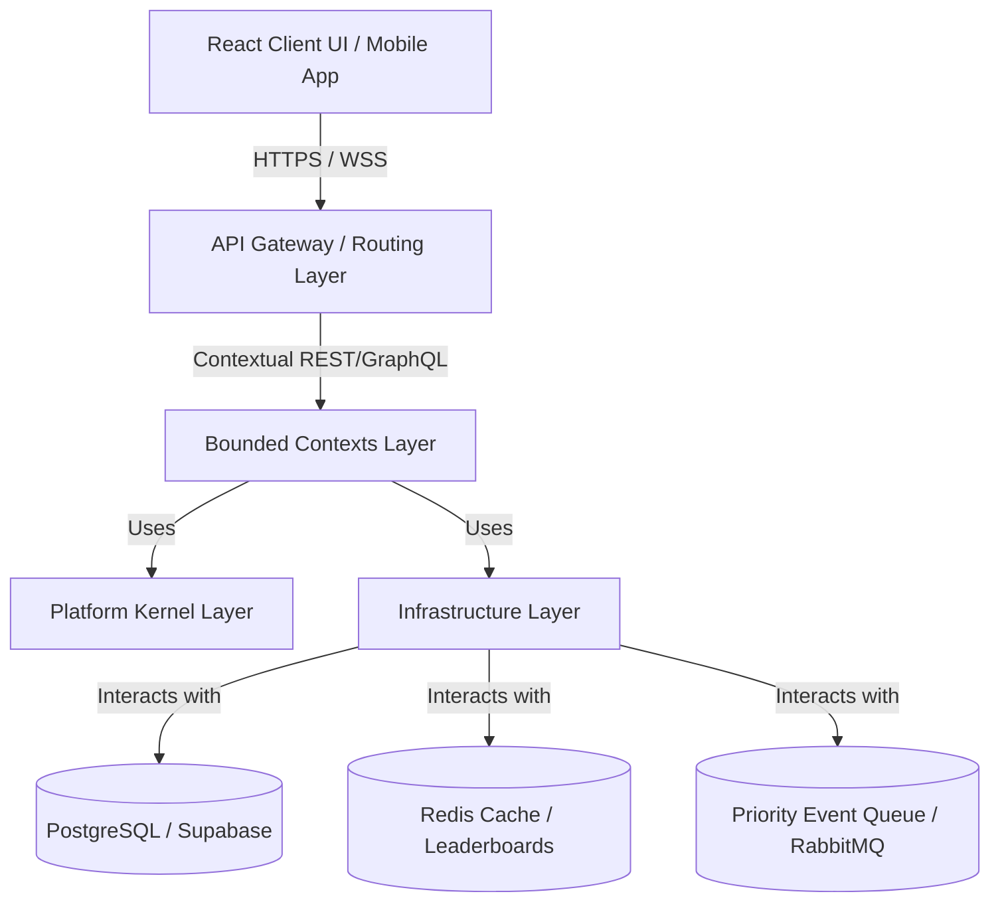
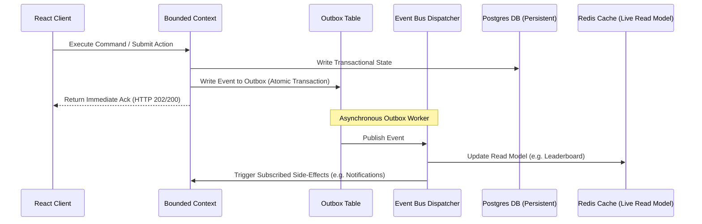

# NextHire AI Architecture Blueprint

**Version**: v1.0
**Last Updated**: 2026-07-16
**Architecture Status**: FROZEN (Changes require an approved ADR)

---

## 1. Logical Architecture Layers

NextHire AI is structured as a layered, modular monolith designed for horizontal scale and eventual microservices migration. Dependencies must only flow **downward**.



### Layer Rules
1. **API Gateway / Routing Layer**: Directs external requests to the respective bounded context. No business rules live here.
2. **Bounded Contexts Layer**: Self-contained domains (Learning, Assessment, Coding, Contest, AI, Voice) exposing explicit public contracts. Direct cross-context imports are strictly forbidden.
3. **Platform Kernel Layer**: Core cross-cutting domain-agnostic tools (Clocks, ID generators, Feature Flags, Policies, EventBus definition).
4. **Infrastructure Layer**: Adapter code for external services (Redis, Docker sandbox, Database connections, LLM APIs). Domain models must never reference infrastructure directly.

---

## 2. Bounded Context Ownership

Each bounded context owns its databases, state, services, and isolated folder structure.

| Bounded Context | Core Responsibility | Database Schema & Tables | Folder Location |
| :--- | :--- | :--- | :--- |
| **Learning** | Management of subjects, progressions, and learning loops. | `subjects`, `progressions`, `chapters` | `src/platform/learning` |
| **Assessment** | Time-bound exams, blueprints, and evaluation checks. | `assessments`, `blueprints`, `submissions` | `src/platform/assessment` |
| **Coding** | Remote code execution, verification sandboxes, checkers. | `coding_problems`, `runtimes`, `testcases` | `src/platform/coding` |
| **Contest** | Multi-player ICPC/Codeforces style live contest orchestrations. | `contests`, `contest_leaderboard`, `registrations` | `src/platform/contest` |
| **AI** | Vector store RAG pipelines, planning, agent orchestration, and context compilation. | `vector_documents`, `ai_sessions` | `src/platform/ai` |
| **Voice** | Real-time speech analysis, interview simulation engines. | `voice_interviews`, `speech_logs` | `src/platform/voice` |

---

## 3. Data Lifecycle & Flow

Data transitions follow clear pipelines depending on whether they are transaction-driven (OLTP) or analytics-driven (OLAP/Read Models).



---

## 4. Unified Error-Handling Strategy

To guarantee platform resilience, all operations follow a structured, predictable error escalation matrix.

```text
[Operation Fails]
       │
       ▼
[Exponential Retry] (Base delay * 2^attempt, up to Max Retries)
       │
       ├── Success ➔ Return Data
       ▼
[Circuit Breaker Trips] (Open state: immediately reject requests to protect database/LLM)
       │
       ▼
[Fallback Strategy Execution] (Return cached read models or default offline values)
       │
       ▼
[Dead Letter Queue (DLQ)] (Unrecoverable events logged for manual operator review)
       │
       ▼
[Operator Recovery Runbook]
```

---

## 5. Security & Isolation Model

1. **Tenant Isolation**: Institution-level multi-tenancy. Every repository query must implicitly append a `tenant_id` filter.
2. **Access Control**: Roles are scoped as `Student`, `Faculty`, and `Admin`. High-privilege tasks (like configuring coding test cases) require both signature verification and audit logging.
3. **Sandbox Isolation**: The Code Execution Engine runs all user code inside isolated, resource-constrained sandboxes (cgroups limits on CPU, memory, and networking).

---

## 6. Versioning Strategy

- **REST APIs**: URL-based versioning (e.g. `/api/v1/learning/...`, `/api/v2/learning/...`).
- **Events**: Schema versioning in the envelope (`CodingSubmitted.v1`, `CodingSubmitted.v2`).
- **Contracts**: Semantic Versioning (semver) for public platform packages.
- **Database Migrations**: Sequential SQL migration scripts with corresponding rollback paths.
- **Prompts**: Versioned releases stored in the prompt registry (`placement-copilot.v1.0`).

---

## 7. Architecture Governance

| Artifact | Evolution Policy / Change Process |
| :--- | :--- |
| **Architecture Blueprint** | Strictly frozen. Alterations require a formal Architecture Decision Record (ADR). |
| **Public Contracts** | Evolve only via minor/patch semver releases. Breaking changes require v-next interfaces. |
| **Database Schema** | Strict forward-only migrations. Direct schema alterations on live tables are prohibited. |
| **Performance Budgets** | Monitored dynamically. Updates to SLOs must be backed by PRR benchmark reports. |
