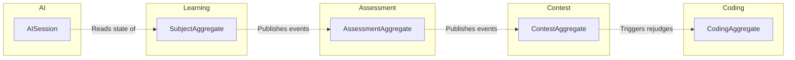

# Bounded Contexts

This document details the boundaries, aggregates, and database/folder ownership for every context on the NextHire AI platform.

---

## 1. Context Definitions & Boundaries

### Context Breakdown

### 1. Learning (M2)
- **Aggregates**: `SubjectAggregate`, `ChapterAggregate`, `LessonAggregate`
- **Ownership**: Tracks user proficiency, modules (Aptitude, Reasoning, Verbal, Coding, SQL), chapters, and lessons.
- **Rules**: Cannot modify Assessments or Contests directly.

### 2. Assessment (M4)
- **Aggregates**: `AssessmentAggregate`, `SubmissionAggregate`
- **Ownership**: Time-bound mocks, blueprints, and evaluation checks. Ensures exams can be structured statically or generated dynamically.
- **Rules**: Relies on Coding context for verifying coding answers.

### 3. Coding (M5)
- **Aggregates**: `ProblemAggregate`, `TestCaseAggregate`
- **Ownership**: Isolated execution profiles, docker-based compiler runner, interactive test checkers, runtime profiles.
- **Rules**: Exposes execution queues to judge submissions asynchronously.

### 4. Contest (M6)
- **Aggregates**: `ContestAggregate`
- **Ownership**: Live contest registrations, leaderboard caching (Redis), rejudging, and real-time SSE clarification broadcasting.
- **Rules**: Submits background rejudge tasks into the Coding priority queue.

### 5. AI (M7)
- **Aggregates**: `AISession`
- **Ownership**: RAG context builder, intent classification, multi-layer memory (Working, Conversation, Learning, Profile, Organization), agent orchestrator.
- **Rules**: Consumes read-only metrics from Learning, Coding, and Assessment to dynamically build candidate profiles.
