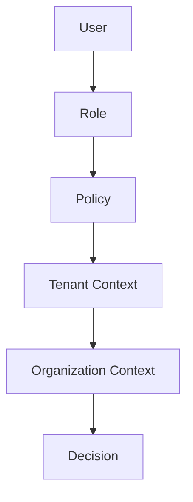

# NextHire AI: Engineering Implementation Handbook

## Current Status

**Current Milestone:**
*Milestone 11: Multi-tenant SaaS & White-label Platform (Code Complete)*

**Current Sprint:**
*Production Readiness (Performance Validation, Penetration Testing, DR Drills)*

**Current Goal:**
*Final PRR Sign-offs and Load Testing prior to launch.*

**Next Deliverable:**
*Platform Load Test Results & Penetration Test Report*  

---

## 2. Dependency Matrix

The dependencies across our major milestones:

| Milestone | Depends On |
| :--- | :--- |
| **M1-M6** Platform Foundations | Core Kernel |
| **M7** Voice Interview Simulator | Learning + Assessment + AI |
| M8 Analytics | Complete | 100% | Dashboard PRR |
| M9 Administration | Complete | 100% | Admin Runbooks |
| M10 Integrations | Complete | 100% | Integration PRR |
| M11 SaaS Platform | Complete | 100% | SaaS PRR (Draft) |Integrations |

---

## 3. Traceability Map

Linking architectural blueprints to their concrete implementations, tests, and operational artifacts.

| Blueprint | Implementation | Test | PRR | Runbook |
| :--- | :--- | :--- | :--- | :--- |
| **Voice Simulator** | `VoiceInterview.ts` | `VoiceInterview.test.ts` | `voice-prr.md` | `voice_runbooks.md` |
| **Analytics Aggregate** | `AnalyticsAggregate.ts` | `AnalyticsPipeline.test.ts` | `analytics-prr.md` | `analytics_runbooks.md` |
| **Telemetry Consumer** | `TelemetryConsumer.ts` | `AnalyticsPipeline.test.ts` | `analytics-prr.md` | `analytics_runbooks.md` |
| **Tenant Aggregate** | `TenantAggregate.ts` | `OrganizationHierarchy.test.ts` | `admin-prr.md` | `admin_runbooks.md` |
| **PBAC Policy** | `PbacPolicy.ts` | `PbacResolution.test.ts` | `admin-prr.md` | `admin_runbooks.md` |
| **Audit Logger** | `AuditLogger.ts` | `AuditLogger.test.ts` | `admin-prr.md` | `admin_runbooks.md` |

---

## 4. Completion Criteria (Definition of Done)

A milestone is considered fully verified only when all criteria are met.

### Engineering Readiness
- [x] Core Implementation Complete
- [x] Automated Tests In Place

### Operational Readiness
- [ ] Monitoring
- [ ] Alerting
- [ ] Runbooks

---

## 5. Performance Targets

| Metric | Target |
| :--- | :--- |
| **Latency** | < 200ms (P95) |
| **Throughput** | > 1000 RPS per instance |
| **Memory** | < 512MB per instance |
| **Availability** | 99.99% Uptime |

---

## 6. Evidence Matrix

Status of completion evidence across recent milestones.

| Milestone | Architecture | Code | Tests | Security | Benchmarks | PRR |
| :--- | :---: | :---: | :---: | :---: | :---: | :---: |
| **M7** Voice | ✅ | ✅ | ✅ | ✅ | ✅ | ✅ |
| **M8** Analytics | ✅ | ✅ | ✅ | ✅ | ✅ | ✅ |
| **M9** Admin | ✅ | ✅ | ✅ | ✅ | ⏳ | ⏳ |
| **M10** Integrations | ✅ | ✅ | ✅ | ✅ | ⏳ | ⏳ |
| **M11** SaaS | ✅ | ✅ | ✅ | ✅ | ⏳ | ⏳ |

*(Legend: ✅ Completed, ⏳ Pending)*

---

## 7. Access Control: PBAC (Policy-Based Access Control)

We have transitioned from strict RBAC to PBAC to ensure long-term scalability and granular permission resolution.

### Evaluation Flow

---

## 8. Remaining Roadmap: Production Readiness

The core architectural implementation (Milestones 1-11) is now code complete. The remaining roadmap strictly focuses on production readiness validation.

### Phase 1 — Performance
- API throughput
- Event throughput
- Redis queue latency
- Outbox processing rate
- Voice interview concurrency
- AI request latency
- Database performance under tenant load

### Phase 2 — Security
- RLS isolation validation
- API key misuse & privilege escalation
- Webhook replay prevention
- OAuth abuse testing
- Custom-domain spoofing
- Tenant impersonation controls
- Secrets rotation

### Phase 3 — Disaster Recovery
- PostgreSQL restore
- Redis rebuild
- Outbox replay
- Dead-letter recovery
- Tenant restore & Cross-region failover
- Key rotation & Webhook recovery

### Phase 4 — Operations
- Monitoring & Dashboards
- Alerts
- Runbooks & On-call procedures

---

> [!NOTE]
> This Implementation Handbook is now treated as a baseline project document. Future updates will primarily consist of updating milestone statuses, the evidence matrix, and traceability maps as M10 and M11 are implemented.
